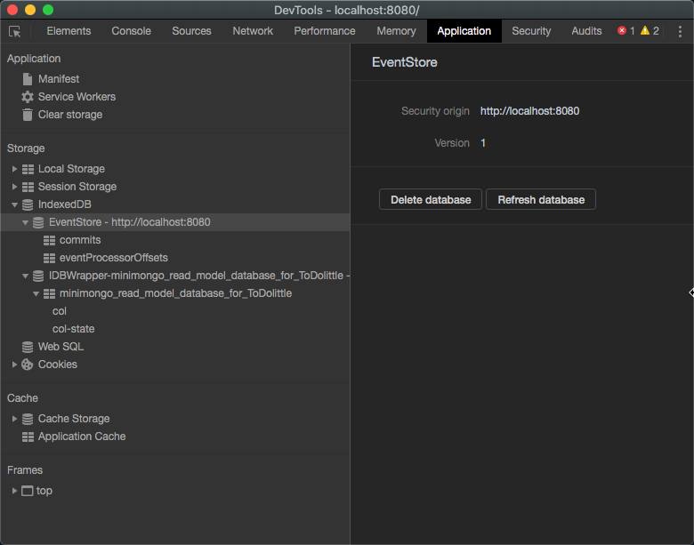
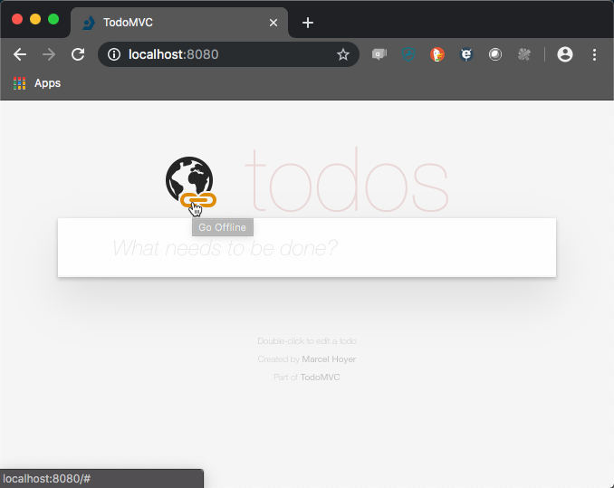
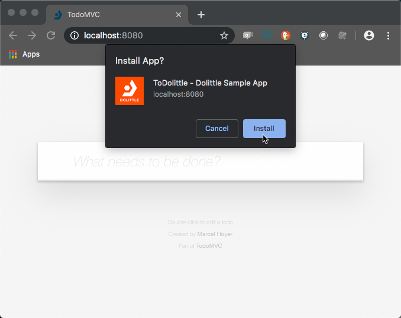
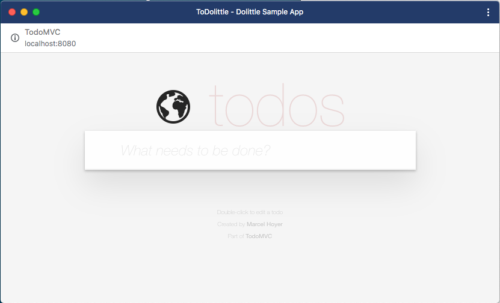
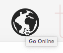
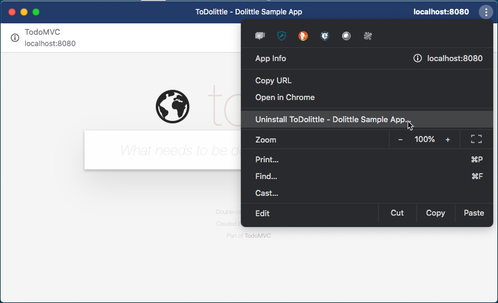
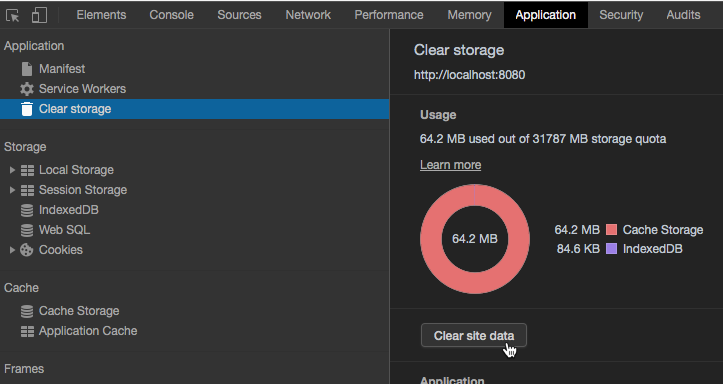

# Basic

This is a very basic [Dolittle](http://www.dolittle.io) sample.

## Prerequisites

You will need to have [.NET Core](https://www.microsoft.com/net/download/core) and
[NodeJS](http://nodejs.org/).

## Getting started

This sample has both a client/server version and a WebAssembly version. All of
the code is shared and proves a write once run many scenario. For the client/server
version you'll to have [MongoDB](https://www.mongodb.com) instance running locally,
it is assuming a non-secured instance for this. Its also assuming the default port
of `27017` to connect to.

To run MongoDB as a docker image, just do:

```shell
$ docker run -p 27017:27017 mongo
```

This will give you a stateless MongoDB instance - meaning that it won't keep state
around between restarts. You can of course mount a volume for state.
Read more on [MongoDBs official Docker image](https://hub.docker.com/_/mongo/).

If you're running Windows, you can also run MongoDB using [Chocolatey](https://chocolatey.org).

```shell
c:\> choco install mongodb
```

To run MongoDB on Windows after installing it with `Chocolatey` you need to create
a data directory, the default is `c:\data\db`.Once this is done you can simply run
the MongoDB daemon, which should be located in `c:\Program Files\MongoDB\Server\X.X\bin\mongod.exe`,
where X.X is the version e.g. **3.6**.

Once the database server is running you can use tools like [MongoDB Compass](https://www.mongodb.com/products/compass)
or [Studio 3T](https://studio3t.com) to connect to the server and verify everything is running.

Read more about the package [here](https://chocolatey.org/packages/mongodb).

## The Sample

### ASP.NET Core

Open the project in [Visual Studio Code](http://code.visualstudio.com/) by opening the root folder or [Visual Studio 2017](https://www.visualstudio.com/vs/) for Windows or Mac using the `TodoTracking.sln` sitting in the root.
The `Core` project is the starting point - which hosts ASP.NET and serves as backend host for the application.

To get the backend running, you simply run the following from the `Core` folder:

```shell
$ dotnet run
```

### WebAssembly

In addition to the `Core` project, there is a project called `Client`. This is the starting point when running it as a WebAssembly project. When running
as a WebAssembly project, you do not need the ASP.NET Core backend running at all.

You do however need to compile this project, as we will use its output in the Web frontend. Do so by running the following from the `Client` folder:

```shell
$ dotnet build
```

### Web - Frontend

All the static Web parts representing the Single Page Application, sits inside the Web folder.
Its built using [Aurelia](https://aurelia.io) using [WebPack](https://webpack.js.org) to compile and pack the files. Aurelia is not a pre-requisite, as you can use any frontend framework to build using Dolittle.
Proxy generation is done by our [build tool](https://dolittle.io/dotnet-sdk/tooling/build_tool/) that will generate proxies for the Dolittle building blocks relevant for the frontend. These are framework agnostic JavaScript
files. Interacting with Commands and Queries is done through the NPM packages provided; [Commands](https://www.npmjs.com/package/@dolittle/commands), [Queries](https://www.npmjs.com/package/@dolittle/queries).

The simplest way to run this is to navigate to the folder containing the `bounded-context.json` (TodoTracking) and run `dolittle run`. If you have docker and are on mac or linux it should start a mongo docker, but on Windows you will have to make sure docker is running yourself (we recommend [Kitematic](https://kitematic.com/)).

To run it manually you will need to restore packages for both .NET and Node, do the following from the `./Source/Web` folder:

```shell
$ npm install
```

or

```shell
$ yarn
```

Depending on wether or not you're using NPM or YARN.

From a terminal from the root of the project do the following from the `./Source/Web` folder you can run one the following commands:

```shell
$ yarn start
```

For a non-WebAssembly experience, or:

```shell
$ yarn start-wasm
```

For the WebAssembly based frontend.

This will run all the tasks and get you up and running, any editing can now be done on the frontend just saved and it will transpile / copy.
Once it is running you can navigate to `http://localhost:5000` with your favorite browser. The backend need to be built. You can
however use the `dotnet watch` command for both the build and the run scenario (WebAssembly vs non-WebAssembly):

```shell
$ dotnet watch build
```

or

```shell
$ dotnet watch run
```

You can play with the commands and queries directly through Swagger by going to `http://localhost:5000/swagger`.

### WebAssembly Events and Data

For [Read Models](https://dolittle.io/runtime/runtime/read/read_model/), the WebAssembly solution leverages
[Minimongo](https://github.com/mWater/minimongo) underneath the covers, which in turn uses
[IndexedDB](https://developer.mozilla.org/en-US/docs/Web/API/IndexedDB_API).

As an eventstore, it uses IndexedDB directly.

You can find both of these databases by opening the browsers developer tools and navigate to the application tab:



### WebAssembly - Going offline and adding to home

The application manifest is configured correctly and should in modern browsers give you the ability to add the application to your home screen
and become a browser app. Below shows an example using Chrome version 74.0.3729.131.

Click the globe with the chain on it:



Once you've done that, after a second or two you should be prompted to install the application.



When installed, the application should open as a desktop application:



To go online with your now offline desktop app, you can simply click the globe again.



For this particular sample, going online and offline doesn't really do anything. It just shows the mechanics.

Once installed, you can uninstall it by doing the following:



If you want to switch back from having run it in WebAssembly, you can clear the entire sites data and get back to a client/server version:

